# **WonderEcon: an interactive LLM-agent economic simulation system**


## 🌍 Overview
 
> ***WonderEcon*** is a configurable, **LLM-driven yet economic-rule-grounded multi-agent simulation system** with two integrated components:

> - an **economic simulation engine**, in which households, firms, commercial banks, a central bank, and a government interact across five markets to form a self-consistent macroeconomic loop;
> - a **player system** that enables human-in-the-loop counterfactuals, allowing users to take over an economic agent, override its decisions, and compare the resulting outcomes with those of the original LLM agent.


<div align="center">
  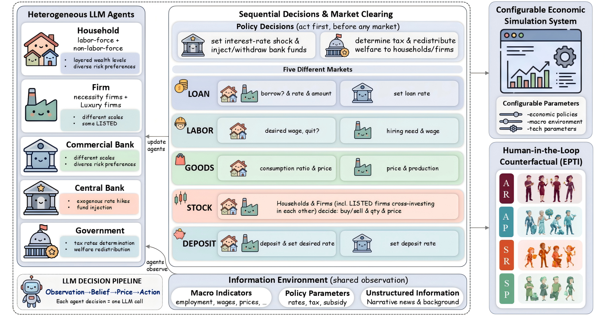
</div>

###  LLM Decision Pipeline

Each priced economic action follows a four-step natural-language pipeline:

1. **Observation**: the agent reads its own state and relevant economic information.
2. **Belief**: the agent forms a free-text economic belief.
3. **Price**: the agent commits to a desired price, wage, rate, or ratio.
4. **Action**: the agent makes a final economic decision.

<div align="center">
  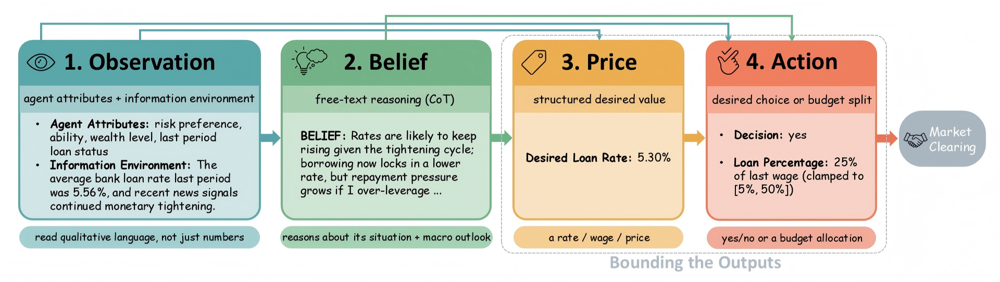
</div>


### Video Demo

<div align="center">
  <a href="./readme_assets/overview/WonderEcon_demo_20260804.mp4">
    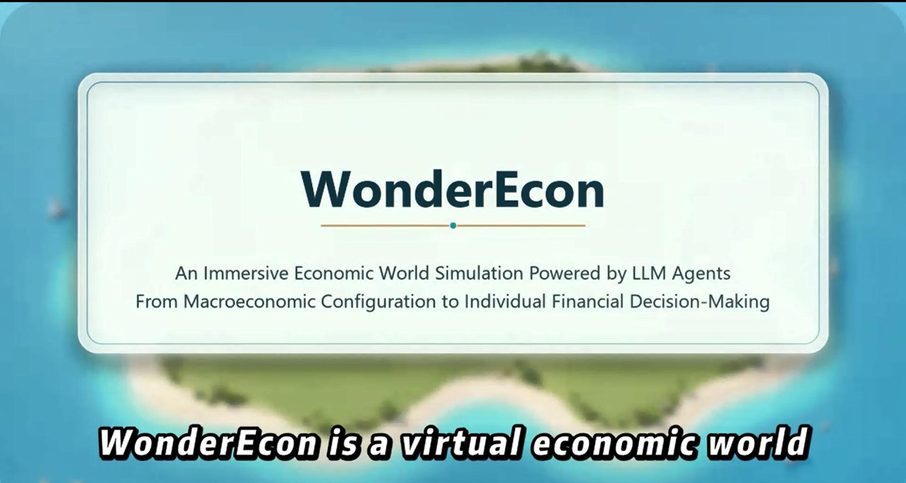
  </a>
</div>

## 🔥 Update
***
| Item | Details |
|---|---|
| **Current Version** | `v0.0.1` |
| **Previous Version** | `v0.0.0` |
| **Major Version** | `v0.0.1` |
| **Release Type** | Bug Fix |
| **Last Updated** | August 4, 2026 |

> ***Current Version*** `v0.0.1`

- Released on August 4, 2026
- This release focuses on frontend modularization, backend API integration, and bug fixes.
- Major changes
  - Frontend
    - Extracted key interface components(`Agent Explorer`, `View Agent.Tick Result`, and `View Simulation Summary`) and map components (`god_view_map`,`routes`and`person`) into independent components
  - Backend
    - Added a new API module named `results_gen`
    - Integrated the `results_gen` APIs into the configuration workflow of the Observer interface
  - Bug fixes
    - Fixed an issue where the `Generate Default World Config` button failed to generate and apply the default world configuration
    - Added a confirmation dialog to prevent unsaved generated results from being overwritten (`Confirm, Generate World Config`, `results_gen`, and `results_default`), Users can 
      - `discard and regenerate`
      - or `view the existing generated result`
      - or `cancel and continue editing`


> ***Previous Version*** `v0.0.0` 
 - Relesed on July 11, 2026
 - Initial project release
 - The demo supported the submission of the related research paper and included:
   - an **economic simulation engine** connecting major economic agents and markets;
   - a **player system** for taking control of agents and comparing human decisions with LLM-generated decisions.
  
## 🚀 Quick Start

### Downloads

All related files are distributed through the [**Releases**](../../releases) page. Download the packages you need from there.

| File | Description |
| --- | --- |
| `WonderEcon-code-v0.0.1.zip` | Source code of the underlying algorithm engine. |
| `WonderEcon-v0.0.1.zip` | Interactive-platform includes "Observe_mode" and "Player_mode". |

### Requirements

* **OS:** Windows only (for Interactive Platform)
* **Python:** Python **3.11 or later** is recommended (Add the Python path to your computer's PATH environment variable)
* **Dependencies:**
  * Python packages:
    ```bash
    pip install camel-ai matplotlib numpy "mcp<2"
    ```
  * **Node.js** (optional, recommended): used only to refresh the building popover data after a simulation run. Without it the system still runs normally — the step fails with a `[Popover] Rebuild failed` message and the popover keeps showing data from the previous build. Download any recent LTS version from [nodejs.org](https://nodejs.org/), then verify with:
    ```bash
    node -v
    ```
    The script uses only Node built-in modules, so no `npm install` is needed.
* **Using a Python Virtual Environment:**
  By default `start_all.bat` invokes whichever `python` is first on your system `PATH`. If you would rather run WonderEcon inside a dedicated virtual environment (conda, venv, etc.), you can ask an AI assistant to adapt the launcher for you. Example prompt:
  > I want to use the Python virtual environment at `<path to your environment>` to run the WonderEcon program located at `<path to WonderEcon>`. Please modify `start_all.bat` accordingly. Point the launcher at the interpreter file named exactly `python.exe` inside that environment — do not use `python3.exe` or any other filename, as WonderEcon checks the interpreter's filename.

  Make sure the path ends with **`python.exe`** — not any other filename:

  ```bat
  ✅  "\path\to\your\env\python.exe"         (conda)
  ✅  "\path\to\your\env\Scripts\python.exe" (venv)
  ❌  "\path\to\your\env\python3.exe"
  ❌  "\path\to\your\env\python3.12.exe"
  ```

  WonderEcon checks the interpreter's filename to tell a normal Python run apart from a packaged build. If the name is anything other than `python.exe` or `pythonw.exe`, it silently reads `settings.json` from the wrong folder (so your API key and model settings are ignored) and writes `results` into your environment directory instead of the project folder. No error is shown, so this is easy to miss.

### Running the Interactive Platform

1. From the [Releases](../../releases) page, download and unzip `WonderEcon-v0.0.1.zip`.
2. Double-click **`start_all.bat`** to launch the system.
3. In the system, you can choose to enter Observe mode / Player mode. If you enter the player mode, you need to choose information including economic month, identity and risk preference. And you can play in the WonderEcon world.
   Once the system opens in observer mode, the quickest way in is to click **"Generate Default World Config"** at the bottom-right, then click **"Enter Observer Console"** to go straight into the world.
4. When you are done, return to the terminal window opened by start_all.bat and press any key to stop all services. Do not close the terminal window directly — doing so will leave background processes running.

### Algorithm Engine

If you only want the underlying simulation engine (without the interactive front end), download and unzip `WonderEcon-code-v0.0.1.zip` from the [Releases](../../releases) page.


## 👁️ God's Eye / Observer Mode(Developing)

###  Configurable Simulation Interface

WonderEcon provides a web-based wizard for configuring:

- agent populations(planned)
  ```
  The default showcase world runs 156 agents (140 households, 12 firms, 2 commercial banks, a central bank, and a government) for 13 monthly ticks.
  ```
  
- economic policy
  ```
  tax rates 
  a clickable interest-rate timeline
  ```

- macro environment 
  ```
  the starting economic-background phase
  editable per-tick news
  brand-effect coefficient
  ```

- technical settings 
  ```
  the agent LLM model
  temperature
  concurrency
  ```
  
Configuration overview:

<table align="center">
  <tr>
    <td align="center" width="50%">
      <b>World Scale Settings</b><br>
      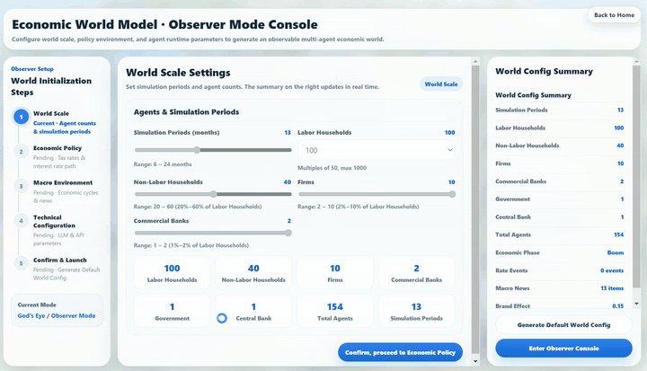
    </td>
    <td align="center" width="50%">
      <b>Economic Policy Settings</b><br>
      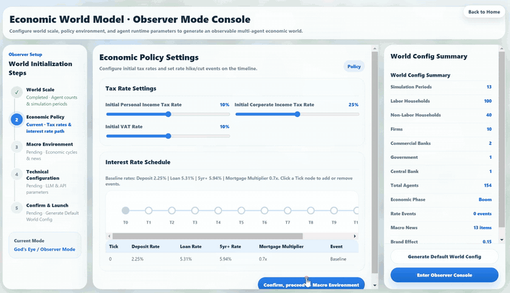
    </td>
  </tr>
  <tr>
    <td align="center" width="50%">
      <b>Macro Environment Settings</b><br>
      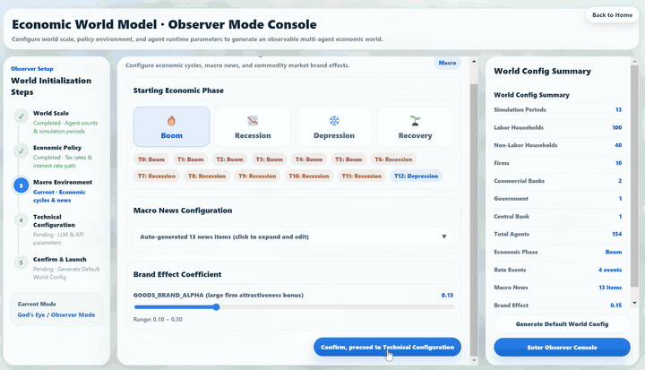
    </td>
    <td align="center" width="50%">
      <b>Technical Config</b><br>
      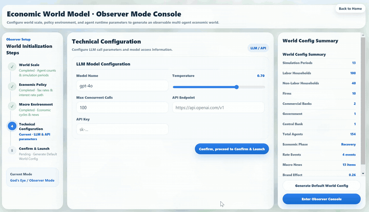
    </td>
  </tr>
  <tr>
    <td align="center" width="50%">
      <b>Confirm and Generate</b><br>
      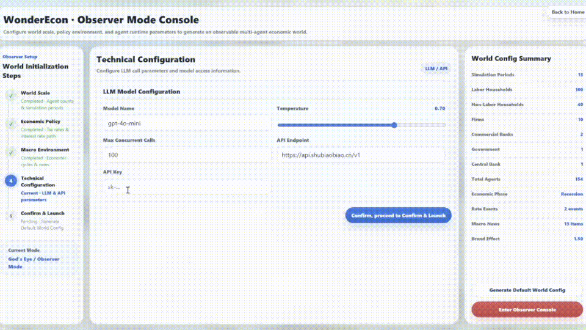
    </td>
    <td align="center" width="50%">
      <b>Discard Unsaved Changes and View Default World</b><br>
      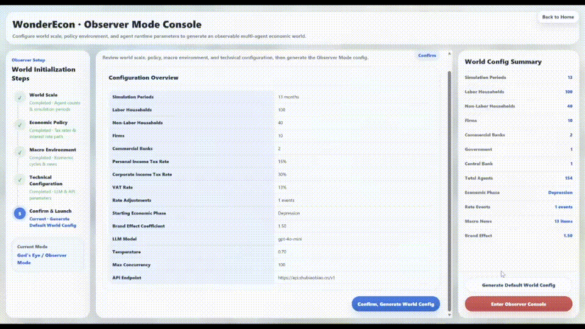
    </td>
  </tr>
</table>

This flowchart shows the full user flow from launching Observer Mode to viewing the final world state, covering configuration editing, result generation and storage, and confirmation dialogs:

<div align="center">
  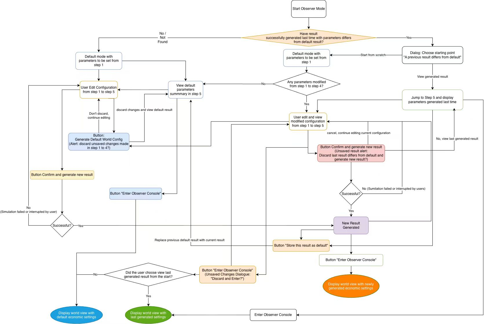
</div>

###  Interactive Economic Map Replay

>Once the scenario is configured, WonderEcon advances the economic world through a fixed monthly tick order.  
- Each tick follows a structured 25-step simulation procedure, as detailed below, and the process repeats until the simulation horizon is reached.
<div align="center">
   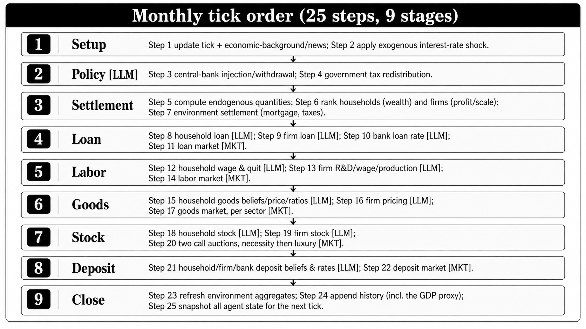
 </div>
 
 ```
    Users can:
   - select different agents at different ticks and inspect their complete decision processes.
   - watch the agent's decision process as an animation (through five markets)
   - inspect the same decision records in JSON format
   - compare agent behavior across different ticks
   - track macro economic indicators
 ```


<table>
  <tr>
     <td align="center">
      <b>Agent Selection</b><br>
      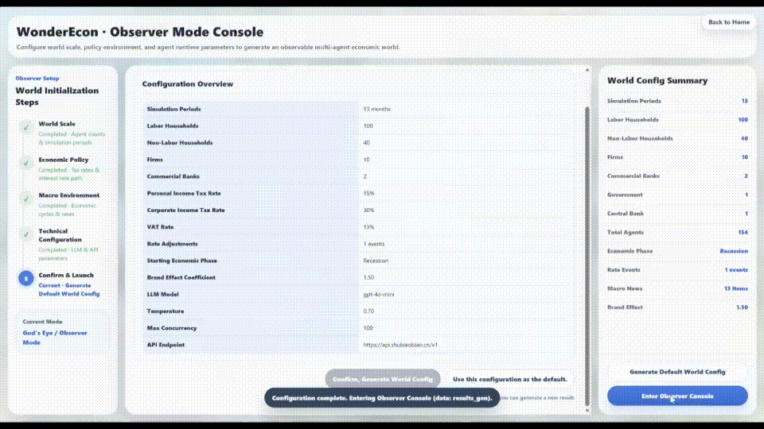
    </td>
    <td align="center">
      <b>View 5 Scenes</b><br>
      
    </td>

  </tr>
  <tr>
    <td align="center">
      <b>JSON View</b><br>
      
    </td>
  <td align="center">
      <b>Macro Economic Indicator Diagrams</b><br>
      
    </td>
  </tr>
</table>

>This replay mechanism allows WonderEcon to connect micro-level agent decisions with macro-level economic dynamics.


## 🎮 Player View / Participant Mode

>The **Player View** turns a completed simulation into a playable counterfactual economic world.  
Instead of only observing the system from a global perspective, a human participant **can enter the simulated economy, take over one household agent, and make decisions across five economic stations.**

###  Create Your Economic Character

Before entering the economic world, the player selects an entry tick and a target profile by choosing 5 levels of:
  - wealth tier
  - employment status
  - risk preference
  
The system then matches the player to one household agent and transfers the agent’s full state to the player.
<div align="center">
  
</div>

After confirmation, the player enters the economic city and begins interacting with the simulated economy.

### Make Decisions on 5 Economic Markets

After choosing the character, the player takes over this household and overrides its original LLM-generated decisions.

You can click guide and hint to view economic environment, market news and get directed to current task:
<div align="center">
  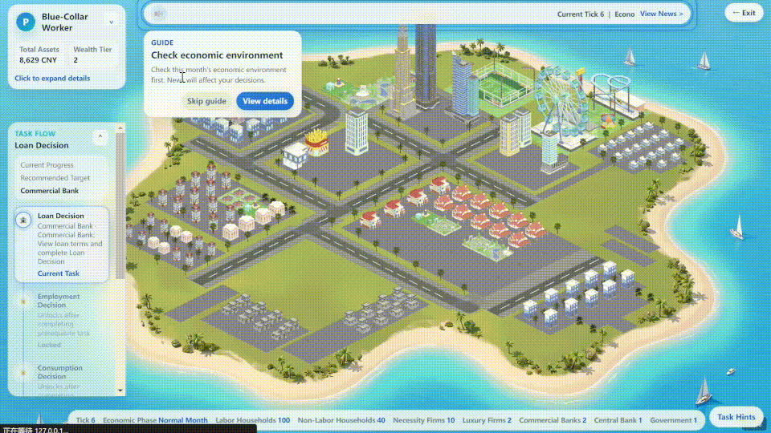
</div>

Across the five economic stations, the player can make decisions on:

| Station | Player Decision | Demo |
|------|------|------|
| **Loan** | <b>Eligibility:</b> Labor-force, employed, wealth level ≤ 2, and not receiving government safety-net subsidies.<br><br><ul><li>Set a desired loan rate.</li><li>Choose whether to borrow.</li><li>If borrowing, set the loan amount (5%–50% of last-tick wage).</li></ul> |  |
| **Employment** | <b>Eligibility:</b> Labor-force players only.<br><br><ul><li>Set a desired wage.</li><li>Choose whether to quit (if employed).</li><li>Unemployed or quitting players re-enter the labor market.</li></ul> | 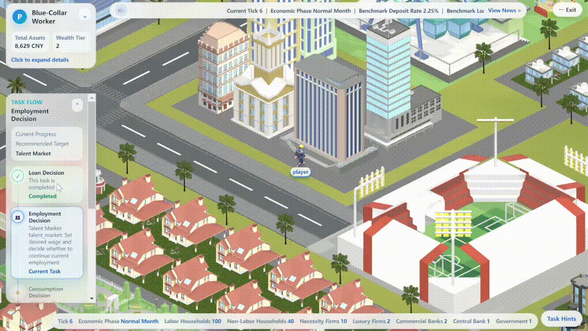 |
| **Consumption** | <ul><li>Set desired prices for necessity and luxury goods.</li><li>Choose the consumption ratio.</li><li>Allocate spending between necessity and luxury goods.</li></ul> |  |
| **Stocks** | <ul><li>Set desired prices for a necessity and a luxury stock.</li><li>Choose the investment ratio.</li><li>Allocate investments between the two stocks.</li><li>Stocks are cleared by call auction.</li></ul> | 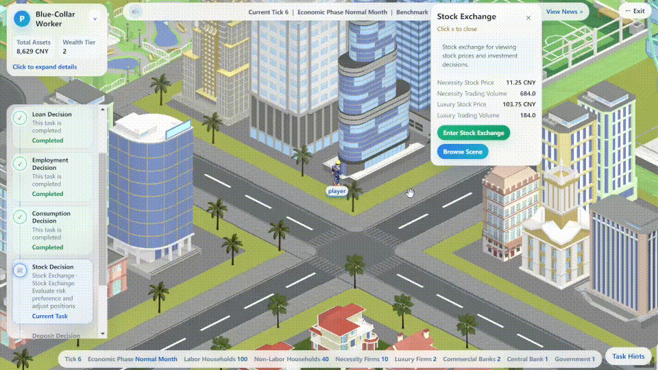 |
| **Deposits** | <ul><li>All remaining assets are automatically deposited.</li><li>Set only the desired deposit rate to influence bank matching.</li><li>Deposits have no cap and always succeed.</li></ul> |  |

All other agents’ decisions remain unchanged.  
This design creates a clean counterfactual comparison between the human player and the original LLM agent.

###  Counterfactual Feedback

After the player completes one economic tick, WonderEcon provides feedback on the player’s performance.

The feedback includes:

- Decision Review
- Performance comparison with original agent and group average:
  - asset change
  - happiness measure
- economic personality profile
<div align="center">
  
</div>

---
## 🌟 Economic Personality Type Indicator (EPTI)

WonderEcon’s Player Mode allows users to take control of a household agent, make decisions across five economic stations, and receive one of 16 Economic Personality Type Indicator (EPTI) classifications based on their economic behaviors.

**EPTI** characterizes a player's economic personality along four dimensions, each with two opposing poles; one representative letter per dimension forms a personality code such as SRCF or APTU.

The system then generates an **Economic Personality Type Indicator (EPTI)** profile along four dimensions:

| Dimension | Poles |
|---|---|
| Time Preference | Spend vs. Amass |
| Risk Attitude | Risk-taking vs. Prudent |
| Market Stance | Contrarian vs. Trend-following |
| Consumption Taste | Utilitarian vs. Fine |

**Dimension 1 · Time preference: Spend (S) ↔ Amass (A)**

This dimension reflects how the player allocates disposable funds between “enjoying now” and 
“accumulating for the future.” 
- S (Spend): tends to put a higher share of available funds into current consumption, valuing 
immediate utility and enjoyment, leaving less for saving and investment — “money is for 
spending, live in the moment.” 
- A (Amass): tends to hold down current consumption and keep more funds as deposits or 
investment, valuing intertemporal security and wealth accumulation, willing to delay 
gratification — “money is for saving, drop by drop.” 

**Dimension 2 · Risk attitude: Risk-taking (R) ↔ Prudent (P)**

This dimension reflects the player's tolerance for risk and volatility in borrowing, portfolio holdings, 
and career choices. 
- R (Risk-taking): willing to take on leverage through borrowing, hold heavy stock positions, prefer 
the more volatile luxury stock, and even quit outright to chase a higher wage; pursues high 
returns and can bear high risk. 
- P (Prudent): low debt, light positions, a preference for stable assets, and a tendency to keep the 
current job; puts capital safety and stability first. 

**Dimension 3 · Market stance: Contrarian (C) ↔ Trend-following (T)**

This dimension reflects whether, in pricing goods and stocks, the player judges independently or 
follows the crowd relative to peers. 
- C (Contrarian): the direction in which desired prices deviate from the market reference is 
opposite to that of the peer majority; has independent judgment and dares to move against the 
trend. 
- T (Trend-following): the deviation direction of desired prices aligns with the peer majority; 
follows the market consensus and moves with the crowd. 

**Dimension 4 · Consumption taste: Utilitarian (U) ↔ Fine (F)**

This dimension reflects how the player splits the consumption budget between necessities and 
luxuries. 
- U (Utilitarian): directs more of the consumption budget to necessities, valuing function and costeffectiveness, practicality first. 
- F (Fine): directs more of the consumption budget to luxuries, willing to pay a premium for quality 
and brand  “if you buy, buy the best; life should have quality.”

**The combination of the first two EPTI dimensions (Time Preference and Risk Attitude) forms the four Core Types：**
<div align="center">
  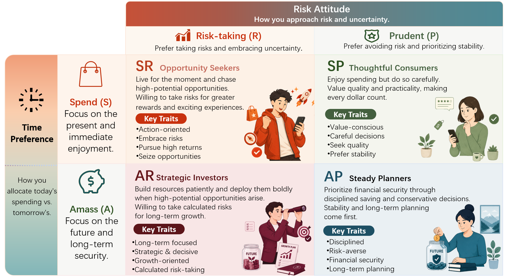
</div>


Each EPTI type is based on the player's revealed economic preferences and represented by a visual character avatar.

<table>
  <tr>
    <td colspan="4" align="center">
      <h2>Opportunity Seekers · 机会探索者（SR）</h2>
      <p>
        <strong>S</strong>pend + <strong>R</strong>isk-taking personality types<br>
        Embrace the present, pursue emerging opportunities, and accept uncertainty in search of greater rewards.<br><br>
        享受当下、主动寻找机会，并愿意承担不确定性以争取更高回报。
      </p>
    </td>
  </tr>
  <tr>
    <td width="25%" align="center" valign="top">
      <h2>SRCU</h2>
      <strong>Contrarian Hunter</strong><br>
      反骨淘金人<br><br>
      <strong>S</strong>pend · <strong>R</strong>isk-taking<br>
      <strong>C</strong>ontrarian · <strong>U</strong>tilitarian<br><br>
      <br><br>
      别人追热闹，我只捡真正值钱的机会。<br><br>
      <sub><em>I look for real value where others aren't looking.</em></sub>
    </td>
    <td width="25%" align="center" valign="top">
      <h2>SRCF</h2>
      <strong>Contrarian Connoisseur</strong><br>
      小众氪金王<br><br>
      <strong>S</strong>pend · <strong>R</strong>isk-taking<br>
      <strong>C</strong>ontrarian · <strong>F</strong>ine<br><br>
      <br><br>
      爆款不香，小众才上头。<br><br>
      <sub><em>I spend on what stands out—not on what stands out to everyone else.</em></sub>
    </td>
    <td width="25%" align="center" valign="top">
      <h2>SRTU</h2>
      <strong>Trend Rider</strong><br>
      爆款冲锋手<br><br>
      <strong>S</strong>pend · <strong>R</strong>isk-taking<br>
      <strong>T</strong>rend-following · <strong>U</strong>tilitarian<br><br>
      <br><br>
      风来了先上车，好用才是硬道理。<br><br>
      <sub><em>When the market moves, I move with it—as long as it delivers.</em></sub>
    </td>
    <td width="25%" align="center" valign="top">
      <h2>SRTF</h2>
      <strong>Trend Lover</strong><br>
      潮流氪金手<br><br>
      <strong>S</strong>pend · <strong>R</strong>isk-taking<br>
      <strong>T</strong>rend-following · <strong>F</strong>ine<br><br>
      <br><br>
      追最热的风，买最闪的自己。<br><br>
      <sub><em>I embrace what's trending and enjoy the best it has to offer.</em></sub>
    </td>
  </tr>
  <tr>
    <td colspan="4" align="center">
      <h2>Thoughtful Consumers · 理性消费者（SP）</h2>
      <p>
        <strong>S</strong>pend + <strong>P</strong>rudent personality types<br>
        Enjoy present consumption while carefully evaluating value, quality, and financial security.<br><br>
        享受当下消费，同时重视实际价值、产品质量与财务安全。
      </p>
    </td>
  </tr>
  <tr>
    <td width="25%" align="center" valign="top">
      <h2>SPCU</h2>
      <strong>Smart Shopper</strong><br>
      省心买买侠<br><br>
      <strong>S</strong>pend · <strong>P</strong>rudent<br>
      <strong>C</strong>ontrarian · <strong>U</strong>tilitarian<br><br>
      <br><br>
      爱买，但每一分钱都要花得明明白白。<br><br>
      <sub><em>I enjoy spending, but every purchase has to make sense.</em></sub>
    </td>
    <td width="25%" align="center" valign="top">
      <h2>SPCF</h2>
      <strong>Quality Seeker</strong><br>
      质感慢买家<br><br>
      <strong>S</strong>pend · <strong>P</strong>rudent<br>
      <strong>C</strong>ontrarian · <strong>F</strong>ine<br><br>
      <br><br>
      不急着下单，只等真正心动的质感。<br><br>
      <sub><em>I spend patiently, waiting for quality that's truly worth it.</em></sub>
    </td>
    <td width="25%" align="center" valign="top">
      <h2>SPTU</h2>
      <strong>Consensus Shopper</strong><br>
      口碑种草官<br><br>
      <strong>S</strong>pend · <strong>P</strong>rudent<br>
      <strong>T</strong>rend-following · <strong>U</strong>tilitarian<br><br>
      <br><br>
      大家都说值，我才安心入手。<br><br>
      <sub><em>I trust the crowd when it's time to spend.</em></sub>
    </td>
    <td width="25%" align="center" valign="top">
      <h2>SPTF</h2>
      <strong>Careful Trend Follower</strong><br>
      精致稳稳党<br><br>
      <strong>S</strong>pend · <strong>P</strong>rudent<br>
      <strong>T</strong>rend-following · <strong>F</strong>ine<br><br>
      <br><br>
      精致可以有，但风险不能有。<br><br>
      <sub><em>I enjoy quality while staying safely with the crowd.</em></sub>
    </td>
  </tr>
  <tr>
    <td colspan="4" align="center">
      <h2>Strategic Investors · 战略投资者（AR）</h2>
      <p>
        <strong>A</strong>mass + <strong>R</strong>isk-taking personality types<br>
        Prioritize future wealth while accepting calculated risks and investing in promising opportunities.<br><br>
        重视未来财富积累，并愿意通过承担经过判断的风险把握成长机会。
      </p>
    </td>
  </tr>
  <tr>
    <td width="25%" align="center" valign="top">
      <h2>ARCU</h2>
      <strong>Contrarian Investor</strong><br>
      冷门抄底王<br><br>
      <strong>A</strong>mass · <strong>R</strong>isk-taking<br>
      <strong>C</strong>ontrarian · <strong>U</strong>tilitarian<br><br>
      <br><br>
      别人看不懂的时刻，我已经悄悄上车。<br><br>
      <sub><em>I invest where others hesitate.</em></sub>
    </td>
    <td width="25%" align="center" valign="top">
      <h2>ARCF</h2>
      <strong>Patient Collector</strong><br>
      小众收藏家<br><br>
      <strong>A</strong>mass · <strong>R</strong>isk-taking<br>
      <strong>C</strong>ontrarian · <strong>F</strong>ine<br><br>
      <br><br>
      平时不乱花，出手只买长期心动。<br><br>
      <sub><em>I save patiently and spend only on lasting value.</em></sub>
    </td>
    <td width="25%" align="center" valign="top">
      <h2>ARTU</h2>
      <strong>Opportunity Rider</strong><br>
      风口上车党<br><br>
      <strong>A</strong>mass · <strong>R</strong>isk-taking<br>
      <strong>T</strong>rend-following · <strong>U</strong>tilitarian<br><br>
      <br><br>
      日常不乱买，趋势来了必须冲。<br><br>
      <sub><em>I save for the right moment, then ride the trend.</em></sub>
    </td>
    <td width="25%" align="center" valign="top">
      <h2>ARTF</h2>
      <strong>Future Investor</strong><br>
      赛道氪金手<br><br>
      <strong>A</strong>mass · <strong>R</strong>isk-taking<br>
      <strong>T</strong>rend-following · <strong>F</strong>ine<br><br>
      <br><br>
      看准赛道就加仓，钱要花在未来感上。<br><br>
      <sub><em>I invest where I believe the future is headed.</em></sub>
    </td>
  </tr>
  <tr>
    <td colspan="4" align="center">
      <h2>Steady Planners · 稳健规划者（AP）</h2>
      <p>
        <strong>A</strong>mass + <strong>P</strong>rudent personality types<br>
        Build wealth gradually, avoid unnecessary risks, and prioritize long-term stability and security.<br><br>
        通过稳步积累财富、减少不必要的风险，追求长期稳定与安全感。
      </p>
    </td>
  </tr>
  <tr>
    <td width="25%" align="center" valign="top">
      <h2>APCU</h2>
      <strong>Rational Navigator</strong><br>
      理智掌舵人<br><br>
      <strong>A</strong>mass · <strong>P</strong>rudent<br>
      <strong>C</strong>ontrarian · <strong>U</strong>tilitarian<br><br>
      <br><br>
      不被消费主义牵绊的一生。<br><br>
      <sub><em>I'd rather build wealth than chase consumption.</em></sub>
    </td>
    <td width="25%" align="center" valign="top">
      <h2>APCF</h2>
      <strong>Thoughtful Minimalist</strong><br>
      低调质感派<br><br>
      <strong>A</strong>mass · <strong>P</strong>rudent<br>
      <strong>C</strong>ontrarian · <strong>F</strong>ine<br><br>
      <br><br>
      钱要慢慢赚，品味要偷偷长。<br><br>
      <sub><em>I save steadily while quietly appreciating quality.</em></sub>
    </td>
    <td width="25%" align="center" valign="top">
      <h2>APTU</h2>
      <strong>Steady Saver</strong><br>
      人间存钱罐<br><br>
      <strong>A</strong>mass · <strong>P</strong>rudent<br>
      <strong>T</strong>rend-following · <strong>U</strong>tilitarian<br><br>
      <br><br>
      余额给我安全感，比任何爆款都上头。<br><br>
      <sub><em>Growing my savings is more satisfying than following trends.</em></sub>
    </td>
    <td width="25%" align="center" valign="top">
      <h2>APTF</h2>
      <strong>Refined Saver</strong><br>
      精致存钱家<br><br>
      <strong>A</strong>mass · <strong>P</strong>rudent<br>
      <strong>T</strong>rend-following · <strong>F</strong>ine<br><br>
      <br><br>
      一边认真存钱，一边认真生活。<br><br>
      <sub><em>I believe saving wisely and living well can go together.</em></sub>
    </td>
  </tr>
</table>


## 📊 Evaluation Highlights

We evaluate WonderEcon from two complementary perspectives.

- In Macro-Level Validity， we test whether the agents’ emergent responses match the stylized facts of monetary tightening.
- In the User Study, we assess the usability of the player platform and the perceived accuracy of the Economic Personality Type Indicator (EPTI) through a preliminary participant evaluation.


### Macro Validity

Across four LLM backends, the system reproduces six well-known economic principles under an ***interest-rate hiking cycle***.

<p align="center">
  <b>Table .</b> Macro-validity targets. Each row verifies an economic principle under the interest-rate-hiking scenario.
</p>

| Economic Principle | Indicator(s) | Predicted Response |
|:---|:---|:---|
| Dividend-Discount Model (DDM) | Stock price | Stock price declines |
| Okun's Law | Employment rate; GDP | Employment and GDP both decline |
| Credit Channel | Loan volume | Loan volume contracts |
| Intertemporal Substitution (Euler) | Deposit volume | Deposit volume rises |
| IS Curve | GDP | GDP growth slows or GDP declines |
| Phillips Curve | Goods prices; employment rate | Inflation slows as employment falls |

<p align="center">
  <b>Table .</b> Principle-verification results across LLM backends. 
</p>

| Economic Principle | Claude-Sonnet-4.6 | GPT-4o | Gemini-3.1-Flash-Lite | Grok-4.1-Fast |
|:---|:---:|:---:|:---:|:---:|
| Dividend-Discount Model (DDM) | 10/10 | 10/10 | 10/10 | 10/10 |
| Okun's Law | 8/10 | 10/10 | 10/10 | 9/10 |
| Credit Channel | 10/10 | 10/10 | 10/10 | 9/10 |
| Intertemporal Substitution (Euler) | 10/10 | 10/10 | 10/10 | 10/10 |
| IS Curve | 10/10 | 10/10 | 10/10 | 10/10 |
| Phillips Curve | 8/10 | 9/10 | 10/10 | 9/10 |
| **Overall** | **56/60** | **59/60** | **60/60** | **57/60** |
>Each cell reports the number of runs, out of ten, in which the emergent trend matches the theoretical prediction defined above.

### User Study

> we evaluate the player platform with 33 participants who each complete one play session. Each participant completed one full play session.

During the session, participants 
- controlled a household agent
- made economic decisions across the available market stations
- reviewed the resulting counterfactual outcomes
- received an EPTI profile.

```
After completing the session, participants rated the system on a five-point Likert scale including three usability dimensions, three experience dimensions, the perceived accuracy of the four EPTI axes, and overall satisfaction.
```

<div align="center">
  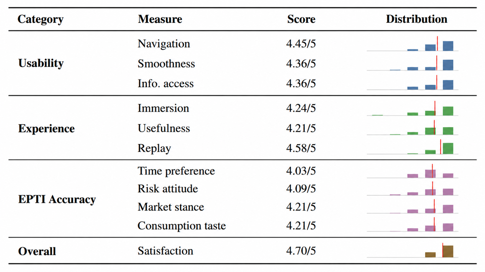
</div>


## 🏠 Hall of Supporters：
### Developed by：
Jing Qian, Boyu Liu, Wenyuan Gu, Hang Ruan, Cheng Huo, Junjie Yang, Mingyu Deng, Zhen Xu, Feilin Li, Jiale Han, Benyou Wang


